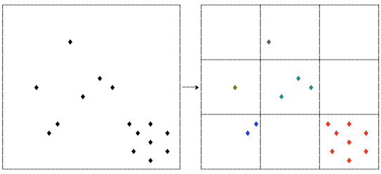

# `@4bitlabs/ennetree` [![License][license]][npm] [![NPM Version][version]][npm] [![NPM Downloads][dl]][npm]



## Installing

```shell
$ npm install --save @4bitlabs/quadtree
```

```shell
$ yarn add @4bitlabs/quadtree
```

```shell
$ pnpm add @4bitlabs/quadtree
```

## Usage

Similar to a [**quadtree**][quadtree], but instead of _binary_ recursive subdivisions, an **ennetree** uses trinary (3&times;3) subdivisions.

Depending on the use-case, this can sometimes yield _more_ efficient spatial queries.

```ts
import { ennetree } from '@4bitlabs/ennetree';

interface Entity {
  /* whatever you like */
}

type Bounds = [left: number, top: number, right: number, bottom: number];

function getBounds(
  it: Entity,
): [x0: number, y0: number, x1: number, y1: number] {
  /* determine bounds for entity */
}

const space = ennetree<Entity>([0, 0, 1000, 1000], Entity.prototype.getBounds);
```

## Options

`ennetree()` accept a third argument of `options`:

| option        | Description                                                  | Defaults |
| ------------- | :----------------------------------------------------------- | -------- |
| `maxDepth`    | The maximum depth/subdivisions that the graph will divide.   | `4`      |
| `maxChildren` | The maximum number of objects in a node before it will split | `10`     |

```ts
const space = ennetree<Entity>([0, 0, 1000, 1000], Entity.prototype.getBounds, {
  maxDepth: 5,
  maxChildren: 50,
});
```

[quadtree]: https://en.wikipedia.org/wiki/Quadtree
[npm]: https://www.npmjs.com/package/@4bitlabs/ennetree
[version]: https://img.shields.io/npm/v/%404bitlabs%2Fennetree
[license]: https://img.shields.io/npm/l/%404bitlabs%2Fennetree
[dl]: https://img.shields.io/npm/dy/%404bitlabs%2Fennetree
